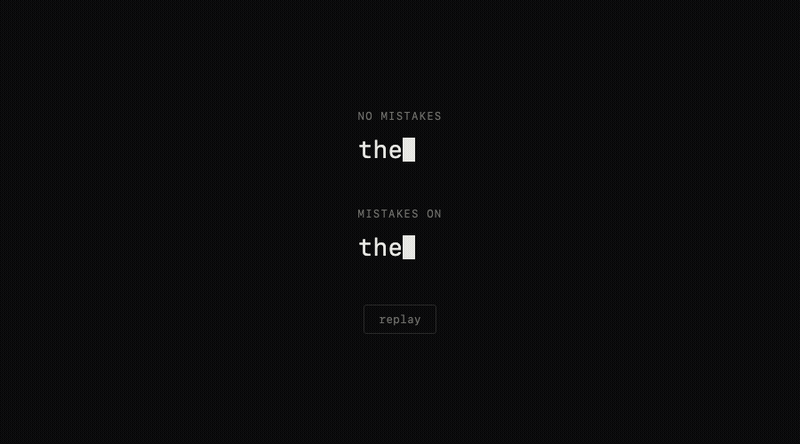

# QWERTease

QWERTY-aware, easing-based typing timing. Types like a person, not a metronome.



## Why

Every "realistic typewriter" effect uses the same trick: a random number between a min and a max. That's more even than real typing — a person's hands don't move at a uniform random speed, they move at a speed shaped by the keyboard itself. A repeated letter is fast because the finger never leaves the key. A letter on the left hand followed by one on the right is fast because the other hand is already moving into position. Home row is fast because that's where your fingers rest. A reach to the bottom row or a key like `y`/`p` is slower because it actually is.

QWERTease models that directly: every keystroke's delay is derived from the real QWERTY layout — which hand the key is on, the physical distance from the previous key, and which row it's in — the same way easing curves shape motion instead of linear interpolation. Applied to typing instead of animation. Hence the name.

## Install

```html
<script src="qwertease.js"></script>
```

Or via a module bundler — `src/qwertease.js` is a plain UMD build, no dependencies.

## Use

```js
const q = new QWERTease(document.getElementById('line'));
await q.type('the quick brown fox jumps over the lazy dog');
```

### Options

```js
new QWERTease(el, {
  speed: 80,          // base ms/keystroke — home-row baseline, actual delay varies from here
  mistakes: false,     // occasionally mistype an adjacent key, pause, backspace, retype
  mistakeRate: 0.035,  // chance per eligible character, 0–1
  cursor: true,        // append a blinking cursor span
  cursorClass: 'qwertease-cursor'
});
```

The timing function is also exported standalone if you just want the numbers, not the DOM typing:

```js
QWERTease.keyDelay(prevChar, char, baseMs) // -> ms
QWERTease.nearestKeys(char, n)             // -> nearest n keys by physical distance
```

## How the timing works

Each key has an approximate physical position (row + column, including the real stagger offset between rows on a physical keyboard) — not just "how many keys apart" on a flat grid. For each character typed, the delay is:

- **Row baseline** — home row (`asdfghjkl`) fastest, the rest of the top row next, everything else (bottom row, `y`/`p`, punctuation) slowest. This follows where a touch-typist's fingers actually rest rather than strict keyboard-row geometry.
- **Repeated key** → fastest possible — minimal travel.
- **Alternating hands** → fast — the other hand can already be moving into position while the first finishes. (This isn't just intuition: an analysis of real keystroke logs found 75% of the *fastest* key-pairs were alternating-hand or same-hand rolls, versus only 38% of the *slowest* — see [Mathematical Multicore](https://mathematicalmulticore.wordpress.com/2010/01/09/should-a-keyboard-layout-optimize-for-hand-alternation-or-for-rolls/).)
- **Same hand** → scaled by actual physical distance between the two keys.
- Plus a small amount of jitter on top, so it doesn't read as a formula even within one category.

## Mistake simulation

While building the timing model, we found [`typecadence`](https://github.com/ccmars/typecadence) — a typing-animation library that simulates typos and corrections. It's a different problem than the one QWERTease solves (its own speed function is a flat random range; its QWERTY knowledge is used only to pick a plausible wrong key), but the idea of simulating mistakes at all was one we hadn't considered, and it's a genuinely nice touch. Credit to that project for putting it on the map.

Rather than port their approach, QWERTease's mistake simulation reuses the same key-position model that drives the timing: when a mistake triggers, `nearestKeys()` finds the physically closest keys to the intended one and types one of those instead, pauses (the beat before a person notices), backspaces, and retypes the correct key — using the same `keyDelay()` function throughout, including for the backspace and the correction. One geometry model doing both jobs, not two separate systems bolted together.

`typecadence` is CC0 — no attribution is legally required — but the idea earned it anyway.

## License

MIT
